  <h2> Hello World! </h2>
   <h3> I'm <a href="https://HarryVed.github.io" target="_blank">HarryVed </a> </h3>
   
 <b>  Software Developer 💼 | Learner 📚 | Maker 👨ğŸ»â€ğŸ’» | Explorer 🔠</b> 

<a href="mailto:harryjjjjved@gmail.com" target="_blank">Mail </a> | <a href="https://HarryVed.github.io" target="_blank">Portfolio </a> | <a href="https://HarryVed.github.io/projects" target="_blank">Projects </a> | <a href="https://HarryVed.github.io/blog" target="_blank">Blog </a> | <a href="https://linkedin.com/in/HarryVed" target="_blank">LinkedIn </a> | <a href="https://twitter.com/HarryVed" target="_blank">Twitter </a> | <a href="https://www.instagram.com/HarryVed" target="_blank">Instagram </a> | <a href="https://www.youtube.com/HarryVed" target="_blank">Youtube </a> | <a href="https://HarryVed.github.io/links" target="_blank">More Links </a>

   
 I code to make lives easier, to learn and for fun! 

 

### Now Playing on spotify 🎧🎵

## **❤️Credits & Thanks**

**[lowlighter](https://github.com/lowlighter): For the awesome github-metrics.**  
**[anuraghazra](https://github.com/anuraghazra/github-readme-stats): Dynamically generated stats for my github readme**  
**[novatorem](https://github.com/novatorem/novatorem): For Dynamic realtime profile ReadMe linked with spotify**  
**[Vercel](https://vercel.com/): For deplying my API's used in this README.**

---

  
 If you like my work, hit <b>✨ Follow ✨</b> for updates 

  
 <b> 🔥 Keep making noises with your keyboard! 🔥 </b>

